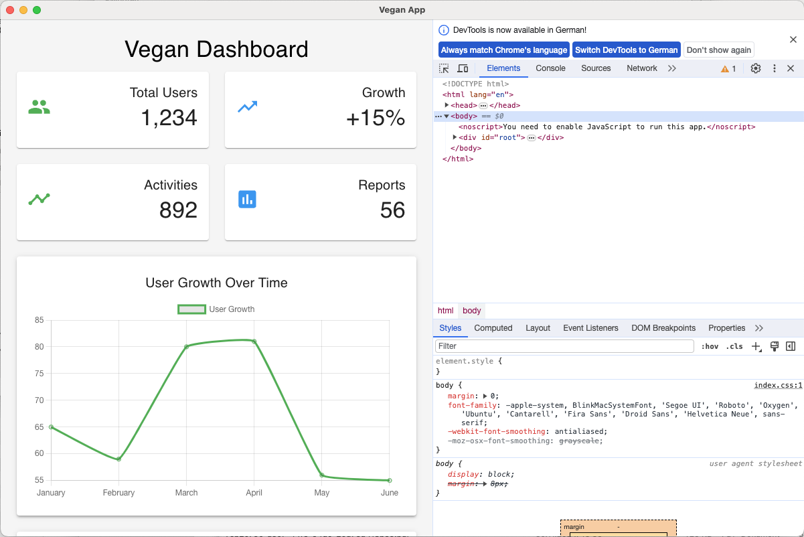

# Vegan - Modern Electron React Boilerplate

A modern, production-ready boilerplate for cross-platform desktop applications using Electron, React, and Node.js. This boilerplate comes with a pre-configured dashboard layout, GitHub Actions for automated builds, and cross-platform compatibility.



## Features

- **Modern Stack**: Electron + React + Node.js
- **Material-UI**: Pre-configured with Material-UI components
- **Dashboard Layout**: Ready-to-use dashboard with charts and cards
- **Hot Reload**: Development environment with hot reload
- **GitHub Actions**: Automated builds for Windows, macOS, and Linux
- **Production Ready**: Configured for building distributable packages

## Prerequisites

Before you begin, ensure you have the following installed:
- Node.js (v18 or higher)
- npm (v8 or higher)
- Git

## Quick Start

1. Clone the repository:
```bash
git clone https://github.com/appshare1603/vegan.git
cd vegan
```

2. Install dependencies:
```bash
npm install
```

3. Start development server:
```bash
npm run electron-dev
```

## Available Scripts

- `npm start` - Start React development server
- `npm run electron-dev` - Start Electron in development mode
- `npm run build` - Build React application
- `npm run electron-build` - Build distributable packages for all platforms

## Building for Production

To build the application for production:

```bash
npm run electron-build
```

This will create distributable packages in the `dist` directory for:
- Windows (.exe)
- macOS (.dmg)
- Linux (.AppImage, .deb)

## Project Structure

```
vegan/
├── .github/
│   └── workflows/    # GitHub Actions workflows
├── public/
│   ├── electron.js   # Electron main process
│   └── preload.js    # Preload script
├── src/
│   ├── App.js        # Main React component
│   └── ...           # Other React components
├── assets/           # Build resources
└── package.json      # Project configuration
```

## Development

The application runs on port 3000 by default in development mode. The Electron process will wait for the React development server to start before launching the window.

### Hot Reload

In development mode, the application supports hot reload for both React components and Electron main process. Any changes to the React components will be immediately reflected in the application.

## Production Builds

The application uses electron-builder for creating production builds. The build configuration can be found in `package.json` under the `build` key.

### Build Configuration

- Windows: NSIS installer
- macOS: DMG package
- Linux: AppImage and DEB packages

## Contributing

1. Fork the repository
2. Create your feature branch (`git checkout -b feature/amazing-feature`)
3. Commit your changes (`git commit -m 'Add some amazing feature'`)
4. Push to the branch (`git push origin feature/amazing-feature`)
5. Open a Pull Request

## License

This project is licensed under the MIT License - see the [LICENSE](LICENSE) file for details.

## Acknowledgments

- [Electron](https://www.electronjs.org/)
- [React](https://reactjs.org/)
- [Material-UI](https://mui.com/)
- [Chart.js](https://www.chartjs.org/)
